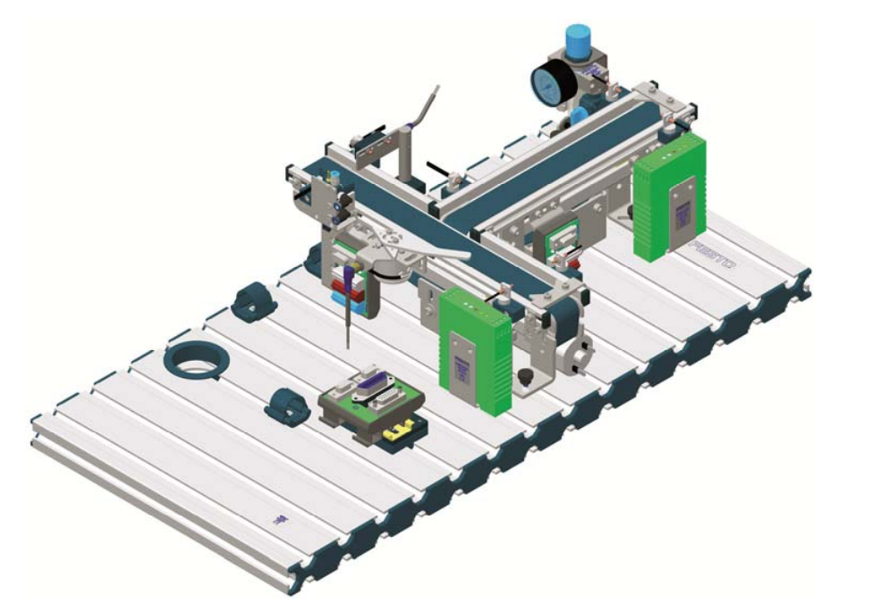

# The Objective
The objective of this project is to separate objects with two distinct colors. This is achieved using a color sensor that detects the color of each object, after which two conveyor belts transport the objects to the correct location based on the detected color.

See the figure below for the system

**Image_1: (Seperation Station)**