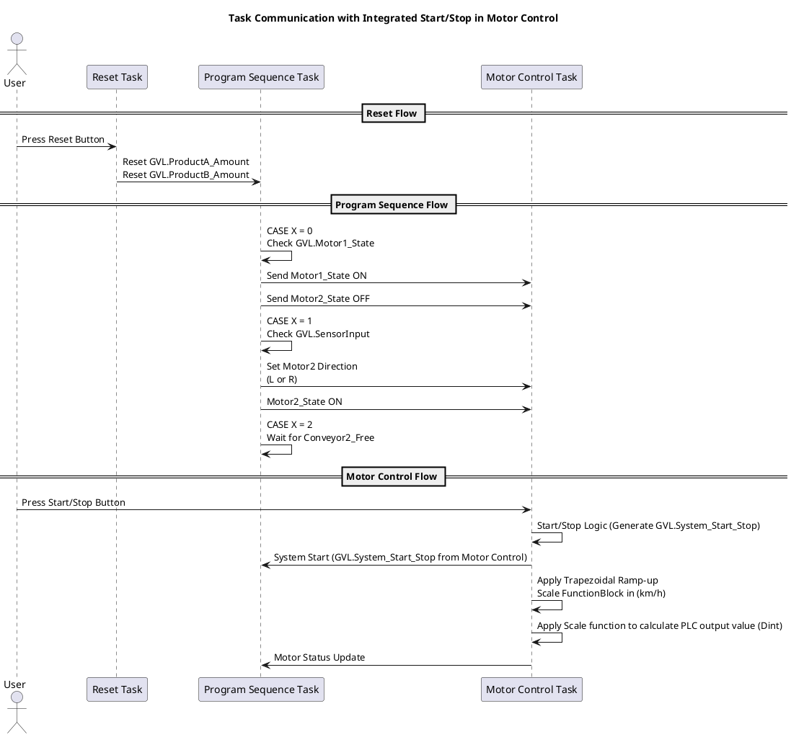

# Communication Between Tasks

Figure 2 (Task Communication with Integrated Start/Stop in Motor Control)

<h2>System Overview and How It Works</h2>
<ul>
  <li><strong>Reset Task:</strong> Resets product counters (e.g., GVL.ProductA_Amount, GVL.ProductB_Amount).</li>
  <ul>
    <li>When the user presses the reset button, the Reset Task sets the product amounts back to zero.</li>
    <li>This reset action ensures the system starts with fresh product counts before motor operations.</li>
  </ul>

  <li><strong>Program Sequence Task:</strong> Manages the states for motor operations and sends commands to the Motor Control Task.</li>
  <ul>
    <li><strong>State 0:</strong> Checks the status of GVL.Motor1_State. If the motor should be ON, it sends a signal to the Motor Control Task to turn Motor 1 ON and Motor 2 OFF.</li>
    <li><strong>State 1:</strong> Monitors sensor inputs to decide motor directions (left or right). Based on sensor readings, the task sends a command to the Motor Control Task to turn Motor 2 ON in the required direction.</li>
    <li><strong>State 2:</strong> Waits for a signal that the conveyor is free before resetting the state back to 0 and repeating the process.</li>
  </ul>

  <li><strong>Motor Control Task:</strong> Controls the motor's speed, applying ramp-up functions and scaling functions to give the correct value for the motor outputs.</li>
  <ul>
    <li>The Motor Control Task handles start/stop logic for the entire system. The user can press a start/stop button, and the task generates a GVL.System_Start_Stop signal. This signal starts or stops the whole motor control process.</li>
    <li>Upon receiving motor state signals from the Program Sequence Task, the Motor Control Task applies a trapezoidal ramp-up (a gradual increase in power) to prevent the motor from getting full power instantly. This ensures smooth acceleration and avoids sudden jolts.</li>
    <li>The system uses scaling to translate the motor speed (in km/h) to a value that the PLC can handle (DINT data type). This scaled output determines the final motor speed.</li>
    <li>Motor status updates are sent back to the Program Sequence Task, confirming whether the motors are ON or OFF, and providing feedback on their operation.</li>
  </ul>
</ul>

<strong>Key Interactions:</strong>

<ul>
  <li>The Program Sequence Task decides the motor's state based on sensor inputs and product flow, while the Motor Control Task executes these commands by controlling the motor's power and direction.</li>
  <li>The Motor Control Task manages the system's start and stop logic, integrating trapezoidal control for smooth motor operation and translating speed settings into PLC output values.</li>
  <li>The Reset Task ensures that product counts are properly reset, keeping the system in sync before it starts.</li>
</ul>
