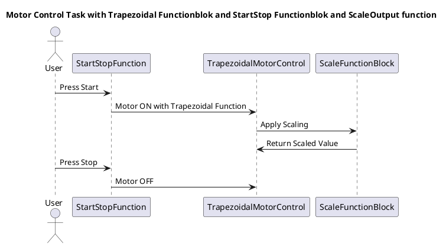

# Program Calling functions by tasks 

```plantuml
@startuml
title Motor Control Task with Trapezoidal Functionblok and StartStop Functionblok and ScaleOutput function

actor User
participant StartStopFunction
participant TrapezoidalMotorControl
participant ScaleFunctionBlock

User -> StartStopFunction : Press Start
StartStopFunction -> TrapezoidalMotorControl : Motor ON with Trapezoidal Function

TrapezoidalMotorControl -> ScaleFunctionBlock : Apply Scaling

ScaleFunctionBlock -> TrapezoidalMotorControl : Return Scaled Value

User -> StartStopFunction : Press Stop
StartStopFunction -> TrapezoidalMotorControl : Motor OFF

@enduml

```