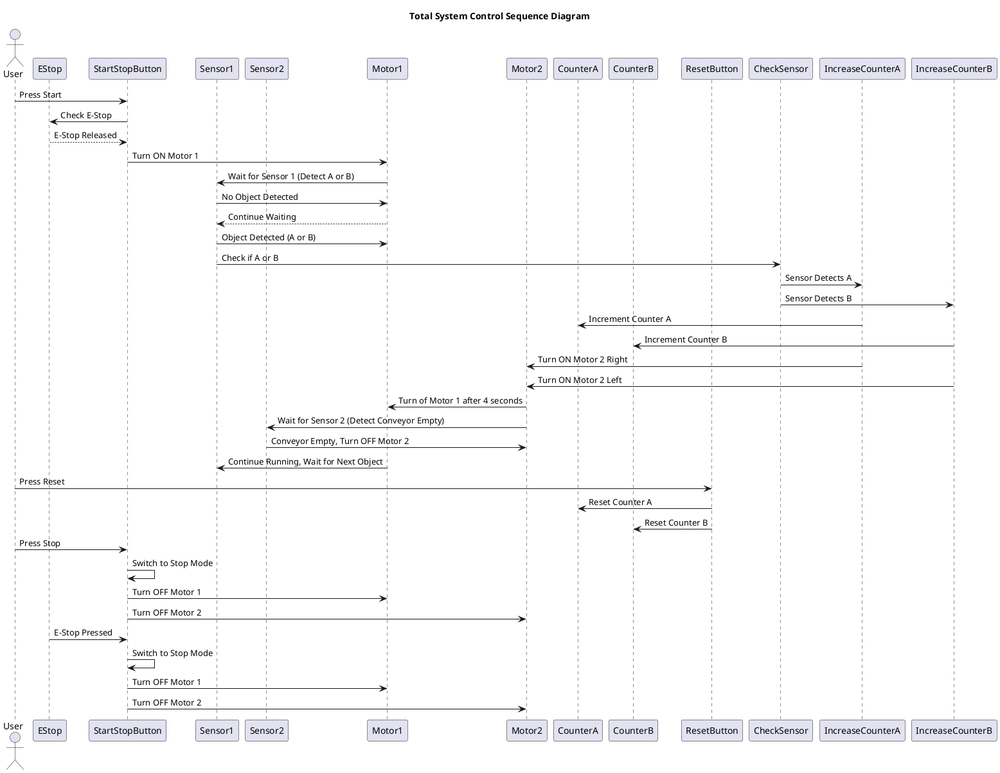

# Sequence Diagram

A sequence diagram is a type of interaction diagram in Unified Modeling Language (UML) that illustrates how processes or objects interact with each other over time in a specific scenario. It shows the sequence of messages exchanged between different elements (such as objects, classes, actors, etc.) in the system and the order in which these interactions occur.

**Key elements of a sequence diagram:**
1. Actors/Participants: Represent the objects, people, or systems involved in the interaction. They are placed horizontally at the top of the diagram.
2. Lifelines: Vertical dashed lines that represent the life span of the participants during the interaction. Each participant has its own lifeline.
3. Messages: Arrows between participants that show the interaction or communication. These messages can represent method calls, signals, or responses.
4. Activations: Rectangles on a lifeline showing the period during which the participant is performing a task (processing time).
5. Time Flow: Time progresses from top to bottom. Interactions closer to the top occur earlier than those lower down.
   
**Purpose:**
- To visualize how different parts of a system collaborate in a particular scenario.
- To capture the chronological order of interactions and processes in a system.
- To model real-time systems or systems where the timing and sequence of events are critical.
  
**Use cases:**
- Describing the flow of logic in use cases or functions.
- Showing how objects and components communicate in distributed systems.
- Demonstrating how external actors (users or other systems) interact with a system.

**Summary**

In summary, a sequence diagram is a useful tool for capturing and understanding dynamic behavior and interactions in a system over time.