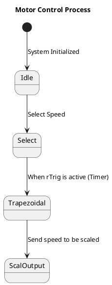

# Task Motor Control

```plantuml
@startuml
title Motor Control Process

[*] --> Idle : System Initialized

Idle --> Select : Select Speed

Select --> Trapezoidal : When rTrig is active (Timer)

Trapezoidal --> ScalOutput : Send speed to be scaled


@enduml
```