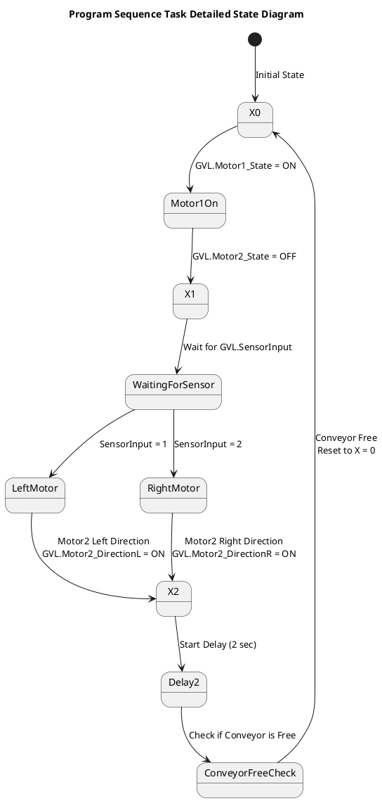

# Task Program Sequence

```plantuml
@startuml
title Program Sequence Task Detailed State Diagram

[*] --> X0 : Initial State
X0 --> Motor1On : GVL.Motor1_State = ON
Motor1On --> X1 : GVL.Motor2_State = OFF

X1 --> WaitingForSensor : Wait for GVL.SensorInput
WaitingForSensor --> LeftMotor : SensorInput = 1
WaitingForSensor --> RightMotor : SensorInput = 2

LeftMotor --> X2 : Motor2 Left Direction\nGVL.Motor2_DirectionL = ON
RightMotor --> X2 : Motor2 Right Direction\nGVL.Motor2_DirectionR = ON

X2 --> Delay2 : Start Delay (2 sec)
Delay2 --> ConveyorFreeCheck : Check if Conveyor is Free

ConveyorFreeCheck --> X0 : Conveyor Free\nReset to X = 0

@enduml

```