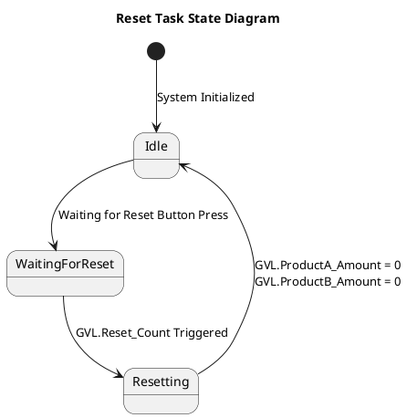

# Task Reset

```plantuml
@startuml
title Reset Task State Diagram

[*] --> Idle : System Initialized
Idle --> WaitingForReset : Waiting for Reset Button Press
WaitingForReset --> Resetting : GVL.Reset_Count Triggered
Resetting --> Idle : GVL.ProductA_Amount = 0\nGVL.ProductB_Amount = 0

@enduml
```