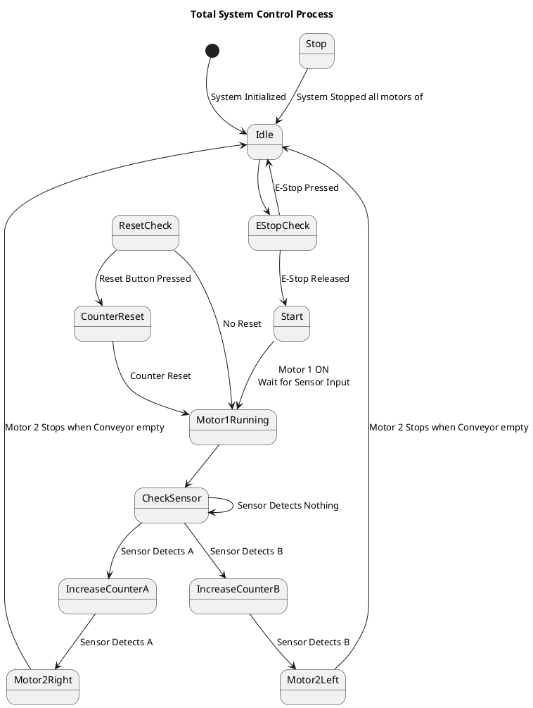

# State Diagram

 A **state diagram** is a graphical representation of a system that shows its states and the transitions between them. It describes the behavior of a system by illustrating how it changes from one state to another in response to certain events or conditions. Each state represents a specific condition or mode of operation, and the transitions are typically triggered by events, actions, or conditions. State diagrams are commonly used in systems design, software engineering, and control systems to model the dynamic behavior of a system over time.

 
